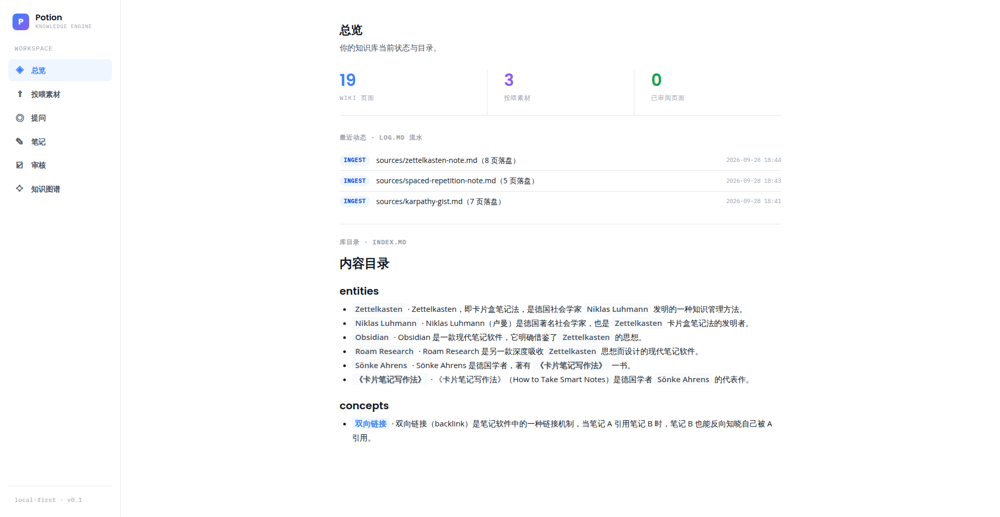
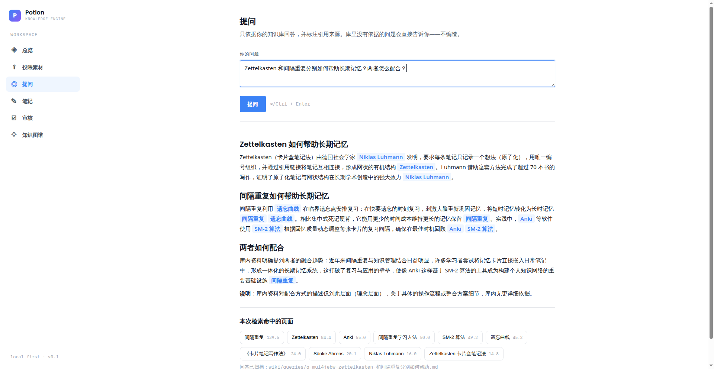
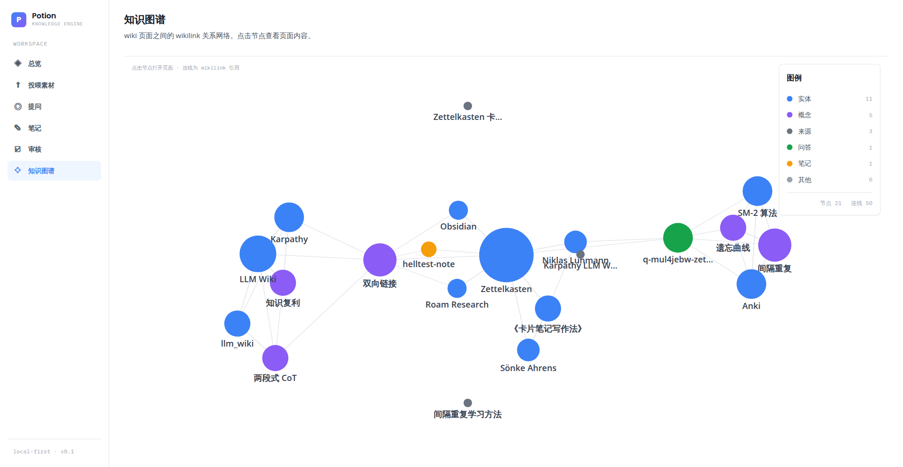
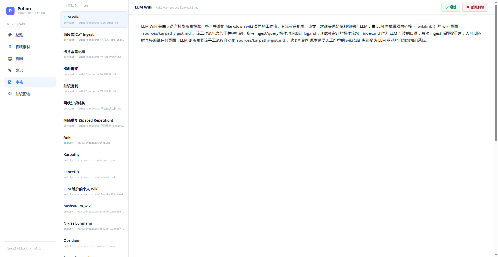

# Potion · Knowledge Engine

> 替你消化知识的笔记本 —— 你写笔记，它替你把素材消化成结构化 Wiki，两者互为一等公民。

Potion 是一个**本地优先**的 Web 应用：你把文章、笔记、想法投喂给它，引擎用两段式 LLM 管道把素材消化成互相链接的 Wiki 页面（实体 / 概念 / 来源摘要）；你随时用自己的笔记（Note）与这套 Wiki 双向链接。所有产物都是纯 Markdown 文件 + git 版本管理 —— **知识库永远属于你，随时可以用 Obsidian 打开**。



## 为什么做这个

现有笔记工具的两难：Notion/Obsidian 结构靠人肉维护，写多了就荒废；AI 笔记工具生成的内容黑盒存储、无法溯源、不敢信任。Potion 的答案是**信任设计**：

- **溯源**：每张 AI 生成页的 frontmatter 带 `sources[]`，正文引用可点击跳转
- **人审**：AI 落盘的页面默认进入审核队列，通过才算正式知识；驳回即删除
- **回滚**：一次操作 = 一次 git 提交，任何动作可整体回滚
- **Note 神圣性**：`notes/` 目录只由人写入，git 历史可证明
- **成本透明**：每次 ingest/query 逐次展示 token 消耗
- **逃生门**：全库纯 Markdown，零锁定

## 快速开始

```bash
# 要求：Node.js ≥ 22
npm install
npm start          # 同时启动 server(:3100) 与 web(:5175)
```

打开 http://localhost:5175 ，新建知识库后投喂第一篇素材即可。LLM 接口通过 `.env` 配置：

```ini
LLM_BASE_URL=https://api.example.com/v1
LLM_API_KEY=sk-xxx
LLM_MODEL_INGEST=gpt-4o-mini    # 摄取用（可选）
LLM_MODEL_QUERY=gpt-4o          # 问答用（可选）
```

> 注意：若你的环境设置了 `NODE_ENV=production` 或 `npm_config_omit=dev`，请用 `npm install --include=dev`，否则 vite 等构建依赖不会安装。

## 功能总览

| 模块 | 说明 |
|---|---|
| 投喂素材 | 粘贴 Markdown/文本 → 两段式消化（分析 → 生成）→ 闸门校验 → 落盘 |
| 提问 | 级联检索（词法 + 图扩展）→ 强模型生成带引用回答；无依据时明说，不编造 |
| 笔记 | 双栏工作区 + CodeMirror 6 live-preview，`[[wikilink]]` 补全任意 wiki 页 |
| 审核 | AI 生成页默认待审，逐页预览后通过 / 驳回删除 |
| 知识图谱 | 笔记 + 实体 + 概念 + 来源 + 问答 的 wikilink 关系网络 |
| 总览 | 库状态、`log.md` 操作流水时间线、index 目录 |



## 架构

```
┌────────────┐   HTTP    ┌─────────────────────────────┐
│  Web (vite) │ ───────▶ │  Server (Fastify)           │
│  React+CM6  │           │  ├─ ingest-pipeline（两段式）│
└────────────┘            │  ├─ query-pipeline（级联检索）│
                          │  └─ @ke/core（闸门/日志/索引） │
                          └──────────┬──────────────────┘
                                     │ 唯一写通道（gate executor）
                          ┌──────────▼──────────────────┐
                          │  data/my-wiki/（纯 Markdown）│
                          │  ├─ notes/   只由人写入      │
                          │  ├─ wiki/    AI 生成，默认待审│
                          │  ├─ index.md log.md AGENTS.md│
                          │  └─ .git（一次操作一次提交）  │
                          └─────────────────────────────┘
```

两段式 ingest（ARCHITECTURE §6.2）：**Phase 1 analyze** 把素材分析为结构化 JSON（实体/概念/claims，带出处 locus）→ **Phase 2 generate** 逐页生成 200-400 字正文（行内 `[[链接]]` 标注出处）→ **闸门校验链**（命名 / 重复 / 标签词表 / 路径越界）→ 落盘 → git 提交。闸门是唯一写通道，AI 没有绕过它的路径。



## 工程实践

- **Monorepo**（npm workspaces）：`packages/core`（闸门、索引、日志、schema）、`packages/agent-tools`（LLM 路由 + RPM 门控）、`apps/server`、`apps/web`
- **TypeScript 严格模式** + TypeBox schema 校验 LLM 输出（不合 schema 自动回喂修复一轮）
- **测试**：`npm test`（node:test，41 用例覆盖闸门校验链、索引重建、日志解析等核心纯函数）
- **韧性**：LLM 429 按 3s/8s/15s 退避重试；重复投喂同一来源按 sha256 幂等跳过
- **审计**：`log.md` 记录每次 ingest/query/note/review，前端时间线可视化



## 文档

- [PRD](PRD.md) — 产品定义与信任设计原则
- [SPEC](docs/SPEC.md) — 功能规格与 MVP 验收（含"地狱测试"）
- [ARCHITECTURE](docs/ARCHITECTURE.md) — 模块划分与 API 契约
- [ADR-001](docs/ADR-001-mvp-scope.md) — MVP 范围决策（两周计划）

## Demo 分镜（3 分钟）

详见 [docs/demo/demo-script.md](docs/demo/demo-script.md)：投喂 → 消化成 wiki → 写笔记互链 → 跨来源提问 → 审核把关 → 图谱形状 → git 回滚。

## 真实操作录屏（agent-browser 实录，未剪辑）

- [▶ demo-part1.mp4](docs/demo/demo.mp4)（约 5 分 50 秒）：总览 → 投喂费曼素材 → 引擎两段式消化全程（含 LLM 等待，未加速）→ 切入笔记视图
- [▶ demo-part2.mp4](docs/demo/demo-part2.mp4)（约 3 分钟）：总览时间线 → 跨来源提问（含引用与"无依据不编造"判定）→ 审核通过一篇（队列 24→23）→ 知识图谱（29 节点 72 连线，笔记节点为琥珀色）

> 录屏为真实浏览器操作逐帧记录，保留全部等待时间，可作为"未剪辑的真实性证明"。关键节点截图见上方各节。

---

local-first · 纯 Markdown · 无锁定 · 2027 春招作品集项目
