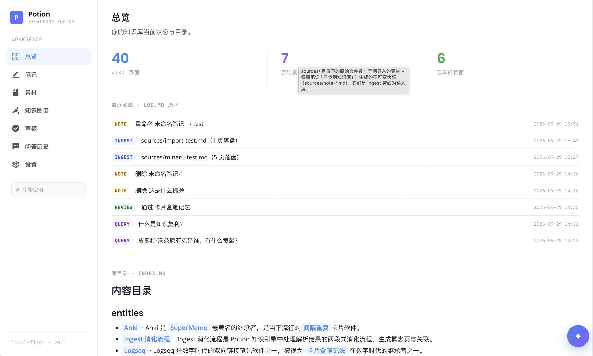
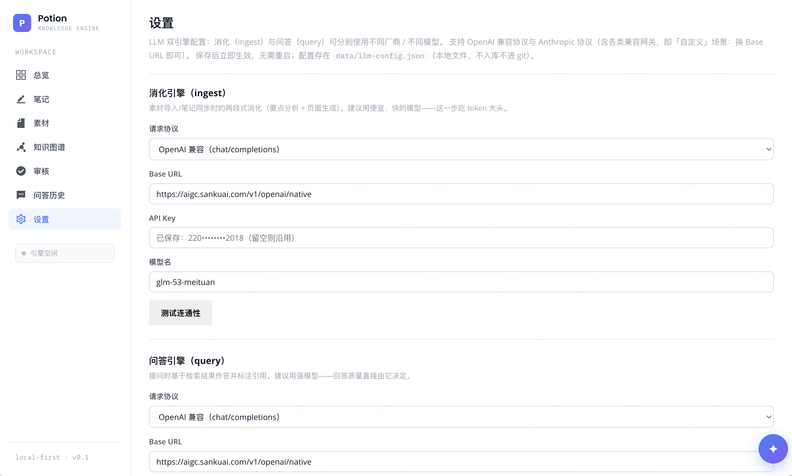
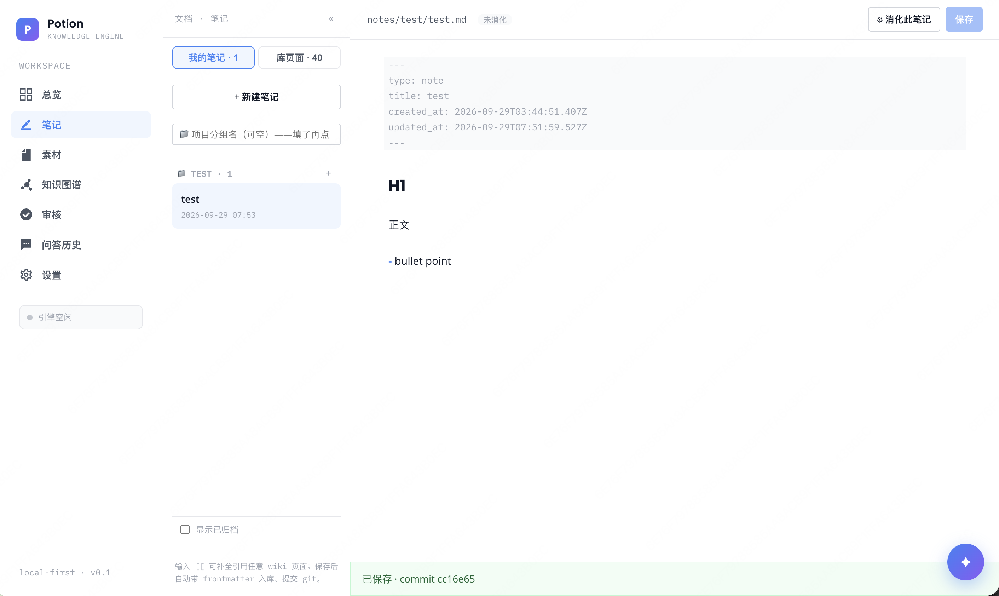
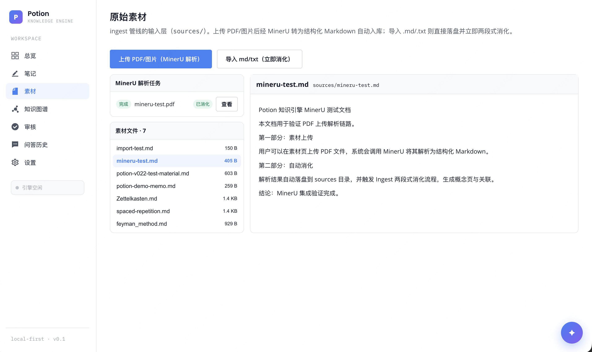
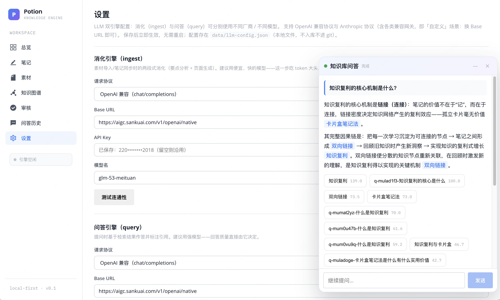
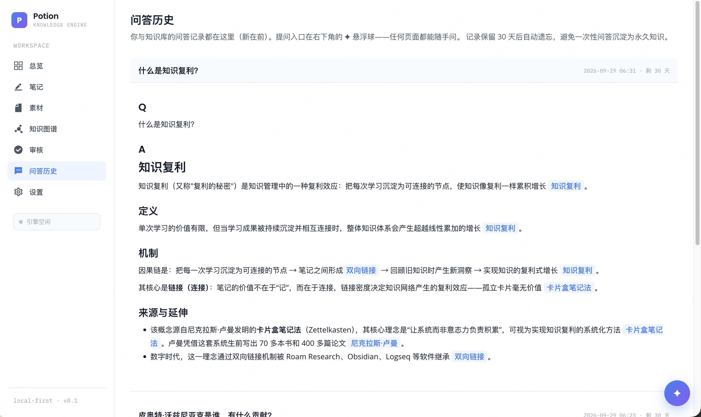
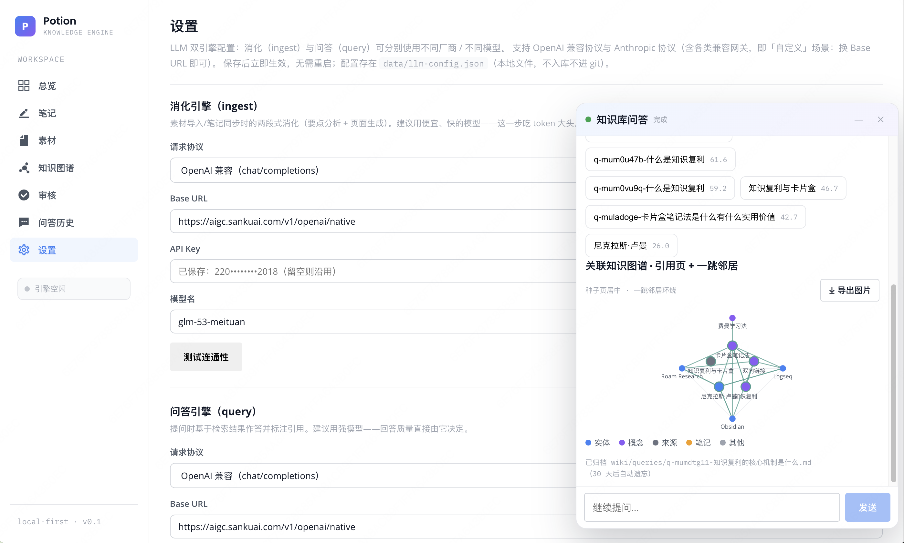
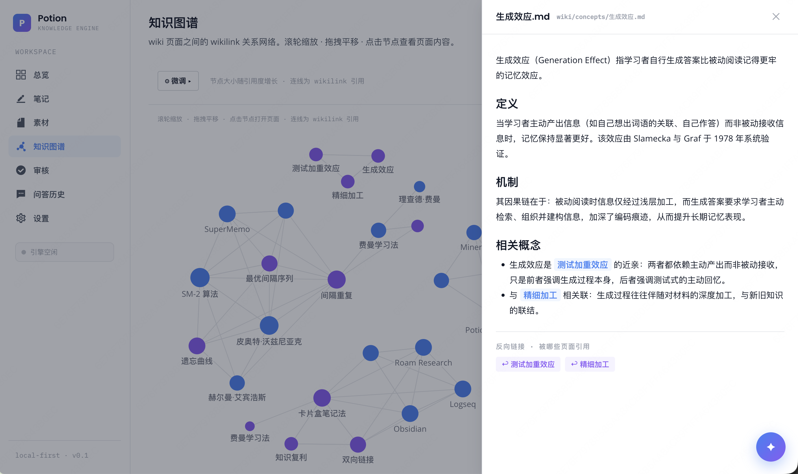
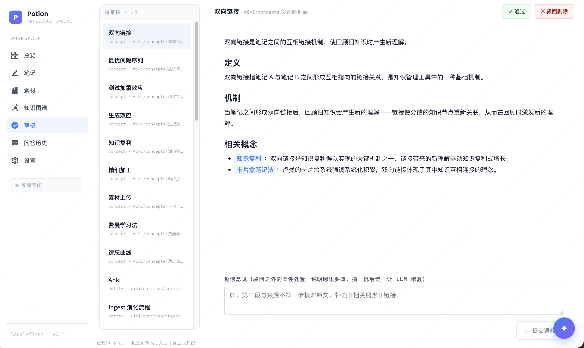

# Potion · Knowledge Engine

> 替你消化知识的笔记本 —— 你写笔记，它替你把素材消化成结构化 Wiki，两者互为一等公民。

Potion 是一个**本地优先**的知识管理应用：把文章、笔记、想法投喂给引擎，两段式 LLM 管道会将素材消化成互相链接的 Wiki 页面（实体 / 概念 / 来源摘要）；你随时用自己的笔记（Note）与这套 Wiki 双向链接。所有产物都是纯 Markdown 文件 + git 版本管理 —— **知识库永远属于你，随时可以用 Obsidian 打开**。



## 演示

[▶ 观看完整演示（约 2 分 50 秒）](docs/demo/demo.mp4)：从空库开始，投喂素材并观察引擎工作台的实时流式生成，审核把关，跨来源提问，最后在知识图谱中查看整体结构。

## 设计理念

现有笔记工具存在两难：Notion/Obsidian 的结构靠人肉维护，难以持续；AI 笔记工具生成的内容黑盒存储、无法溯源、难以信任。Potion 的答案是**信任设计**：

- **溯源**：每张 AI 生成页的 frontmatter 带 `sources[]`，正文引用可点击跳转
- **人审**：AI 落盘的页面默认进入审核队列，通过才算正式知识；驳回即删除；**驳回之外还可返修**——写一条修改意见进返修池，攒一批后让 LLM 统一修复，修完回到待审
- **活结构**：Wiki 不是一次性生成物——编辑任意页面后点「同步到知识库」，LLM 感知 diff 对关联页面做局部维护
- **回滚**：一次操作 = 一次 git 提交，任何动作可整体回滚
- **Note 神圣性**：`notes/` 目录只由人写入，git 历史可证明
- **成本透明**：每次 ingest/query 逐次展示 token 消耗，LLM 流式输出全程显化
- **零锁定**：全库纯 Markdown，随时迁出

## 快速开始

```bash
# 要求：Node.js ≥ 22
npm install
npm start          # 同时启动 server(:3100) 与 web(:5175)
```

打开 http://localhost:5175 ，新建知识库后投喂第一篇素材即可。LLM 接口通过 `.env` 配置，也可在应用内的「设置」页填写（OpenAI 兼容 / Anthropic 协议，ingest 与 query 可分别用不同厂商/模型，保存即生效）：

```ini
LLM_BASE_URL=https://api.example.com/v1
LLM_API_KEY=sk-xxx
LLM_MODEL_INGEST=gpt-4o-mini    # 摄取用（可选）
LLM_MODEL_QUERY=gpt-4o          # 问答用（可选）
```



## 功能

| 模块 | 说明 |
|---|---|
| 文档工作台 | 我的笔记（项目分层）与库页面（wiki/sources）双 tab，全部文档可查看编辑；每篇笔记带消化状态徽标（未消化 / 已同步 / 有改动未同步），一键「同步到知识库」触发消化或局部维护 |
| 素材页 | ingest 管线的输入层：上传 PDF/图片经 [MinerU 精准解析](https://mineru.net)转为结构化 Markdown 自动入库；导入 .md/.txt 则直接落盘并立即两段式消化；左侧任务与文件列表、右侧内容预览 |
| 提问 | 悬浮球随手问（任意页面右下角），级联检索（词法 + 图扩展）→ 生成带引用的回答并标注相关度；无依据时明说，不编造；回答后可展开**关联知识图谱**局部子图并可导出图片 |
| 问答历史 | 与知识库的全部问答记录（新在前），回答带引用标注与局部图谱；记录保留 30 天后自动遗忘，避免一次性问答沉淀为永久知识 |
| 审核 | AI 生成页默认待审：通过 / 驳回删除 / **💬 返修附意见**；返修池支持「⚙ 统一修复」批量执行，运行期间新意见自动暂缓进池 |
| 知识图谱 | 实体 / 概念 / 笔记 / 问答的 wikilink 关系网络，支持缩放平移与布局参数调节，点击节点侧栏查看页面内容与反向链接；**🩺 图谱自检**：孤立页 / 重复页 / 枢纽页 / 无内容支撑连线四类嫌疑检查，AI 建议写入页面 suggestions 待人工审核 |
| Agent 问答 | 悬浮球提问可选多步 agent 模式：模型按需调用只读工具（search_kb / read_page / list_neighbors / web_search）多步探索后综合回答；上下文超预算自动压缩（复用 pi-agent-core compaction） |
| 定时任务 | 自然语言建任务（「每天早上七点搜 AI 资讯」）：Tavily 搜索 → 证据页物化 → LLM 综合日报落收件箱；停机错过 <24h 自动补做，≥24h 放弃并通知；任务前自动注入用户指令 |
| 收件箱 | 定时日报的收件层：未读蓝点、原文预览、LLM 综合快报；一键「消化进图谱」把证据页交给 ingest 管线（闸门/幂等/待审全沿用） |
| 便利贴 | 用户与 AI 的异步对话面板：指令贴（定时任务执行前自动读取生效）、待办、留言；AI 会发帖（任务跳过通知等）；7 天保质期过期归档不删除，可回复跟帖/完成/放弃 |
| 建议 | 页面级 suggestions[] 双源同池：audit 自动建议与用户留言共存 frontmatter，审核页一键「转返修」或「留建议」，返修池统一执行 |
| 工作台 | agent 任务过程留痕：每条多步问答按「背景目标 → 探索链路 → 执行链路 → 结果迭代」四节结构落盘，时间线可回放 |
| 总览 | 库状态、`log.md` 操作流水时间线（ingest / query / edit / sync / rework / task / bulletin / digest / audit…）、index 目录、定时任务卡片 |



笔记的消化状态由 frontmatter 元数据（`ingested_sha256` / `last_ingested_at`）驱动：编辑保存后自动变「有改动未同步」，点「⚙ 同步到知识库」消化后回到「已同步」——你永远知道哪些改动还没进引擎。









## 架构

```
┌────────────┐   HTTP    ┌─────────────────────────────┐
│  Web (vite) │ ───────▶ │  Server (Fastify)           │
│  React+CM6  │           │  ├─ ingest-pipeline（两段式）│
└────────────┘            │  ├─ maintain-pipeline（同步）│
                          │  ├─ query-pipeline（级联检索）│
                          │  └─ @ke/core（闸门/日志/索引） │
                          └──────────┬──────────────────┘
                                     │ 唯一写通道（gate executor）
                          ┌──────────▼──────────────────┐
                          │  data/my-wiki/（纯 Markdown）│
                          │  ├─ notes/   只由人写入      │
                          │  ├─ wiki/    AI 生成，默认待审│
                          │  ├─ index.md log.md AGENTS.md│
                          │  └─ .git（一次操作一次提交）  │
                          └─────────────────────────────┘
```

两段式 ingest（ARCHITECTURE §6.2）：**Phase 1 analyze** 将素材分析为结构化 JSON（实体 / 概念 / claims，带出处 locus）→ **Phase 2 generate** 逐页生成结构化正文（实体页：概述/关键事实/关系网络/来源；概念页：定义/机制/相关概念/常见误区）→ **闸门校验链**（命名 / 重复 / 标签词表 / 路径越界）→ 落盘 → git 提交。闸门是唯一写通道，AI 没有绕过它的路径。

v0.3 Agent 化（[ADR-003](docs/ADR-003-v0.3.md)）：agent loop（工具白名单只读围栏 + 轮次上限 + 轨迹留痕）+ 自建轻量 scheduler（tasks.json 落盘 + 内存扫描 + 启动补偿）+ 图谱自检管线 + bulletin board + workbench 轨迹 + 上下文压缩（复用 pi-agent-core 纯函数，摘要走自有 LLM 路由边界）。MCP / 代码执行 / 工具生产推迟 v0.4+。



## 工程实践

- **Monorepo**（npm workspaces）：`packages/core`（闸门、索引、日志、schema）、`packages/agent-tools`（LLM 路由 + RPM 门控 + OpenAI/Anthropic 双协议）、`apps/server`、`apps/web`
- **TypeScript 严格模式** + TypeBox schema 校验 LLM 输出（不合 schema 自动回喂修复一轮）
- **测试**：`npm test`（node:test，118 用例：闸门校验链、调度语义、agent loop、compaction、audit、bulletin、workbench、e2e 全链路等）
- **韧性**：LLM 429 按 3s/8s/15s 退避重试；重复投喂同一来源按 sha256 幂等跳过
- **审计**：`log.md` 记录每次 ingest/query/note/edit/sync/review/rework，前端时间线可视化
- **SSE 显化**：LLM 流式 token、管道阶段、耗时指标经 `/api/events` 实时推送，无黑盒等待
- **agent 围栏**：工具白名单（只读）+ 轮次上限 + 每次任务四节轨迹落盘（workbench）；上下文超预算自动压缩，摘要失败降级不压（压缩不能杀死任务）
- **溯源守门**：联网搜索结果必须先物化为 sources/ 证据页才可被 wiki 引用；无据补链自动降级为备注说明



## 文档

- [PRD](PRD.md) — 产品定义与信任设计原则
- [SPEC](docs/SPEC.md) — 功能规格与 MVP 验收
- [ARCHITECTURE](docs/ARCHITECTURE.md) — 模块划分与 API 契约
- [ADR-001](docs/ADR-001-mvp-scope.md) — MVP 范围决策
- [ADR-002](docs/ADR-002-v0.2.md) — v0.2 文档工作台/返修池决策 + Agent 化三阶段路线

---

local-first · 纯 Markdown · 无锁定
